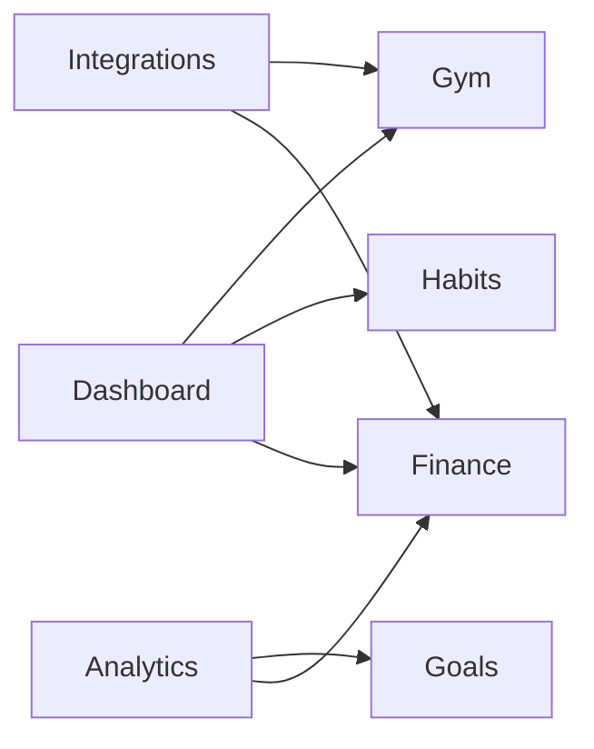

# Module Diagram

## Purpose
Visualize the LifeOS ecosystem architecture.

## Responsibilities

## Design Decisions
The diagram represents clear frontend, backend, data, and asynchronous-work boundaries.

## Best Practices
Keep diagrams aligned with the architecture documentation.

## Future Improvements
Add operational detail as the deployment matures.

## Related Documentation
[Architecture](../../ARCHITECTURE.md)

